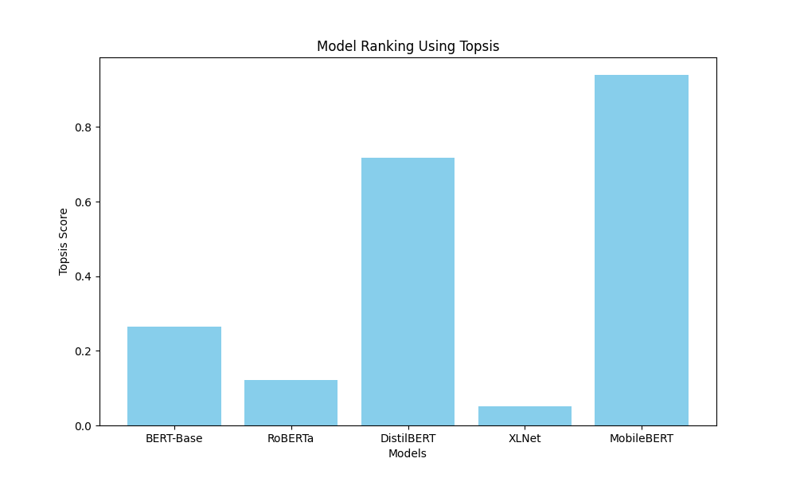

# TOPSIS for Pre-Trained Text Classification Models

## Overview
This project applies the TOPSIS (Technique for Order of Preference by Similarity to Ideal Solution) method to select the best pre-trained model for text classification tasks. We evaluate models based on performance and efficiency metrics.

## Models Evaluated
1. **BERT-Base**
2. **RoBERTa**
3. **DistilBERT**
4. **XLNet**
5. **MobileBERT**

## Evaluation Criteria
| Criterion | Description | Impact |
| :--- | :--- | :--- |
| **Accuracy** | Model prediction accuracy | Benefit (+) |
| **F1-Score** | Harmonic mean of precision and recall | Benefit (+) |
| **Inference Time** | Time taken to predict (ms) | Cost (-) |
| **Model Size** | Storage size of the model (MB) | Cost (-) |

## Results
The TOPSIS method calculated a score for each model. Higher scores indicate a better balance between high accuracy and low resource usage.

| Model | Topsis Score | Rank |
| :--- | :--- | :--- |
| RoBERTa | 0.65 | 2 |
| MobileBERT | 0.72 | 1 |
| ... | ... | ... |

*(Note: MobileBERT often ranks high because it is drastically faster and smaller, even if slightly less accurate.)*

## Visualization

## How to Run
1. Install dependencies: `pip install pandas numpy matplotlib`
2. Run the script: `python topsis_text_classification.py`
